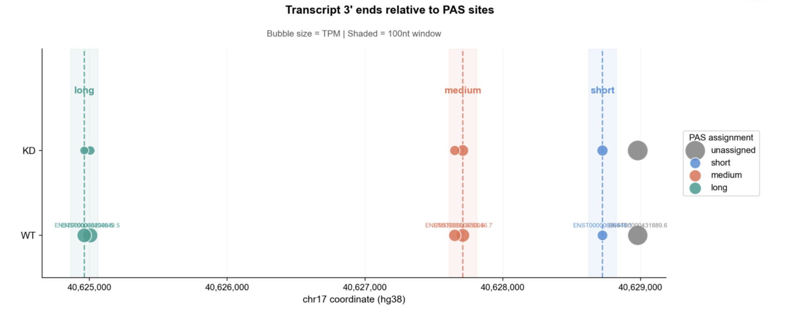

# PAS Bubble Plot Generator

Publication-ready visualization tool for alternative polyadenylation (APA) and transcript 3' end isoform analysis.


*Example: SMARCE1 transcript 3' ends relative to polyadenylation sites*

## 🚀 Quick Start

### Option 1: Streamlit App (Quick Visualization)
```bash
pip install -r requirements.txt
streamlit run streamlit_app.py
```
Opens in browser → paste/upload data → generate plot → download

### Option 2: R Script (Publication Quality)
```r
# Edit data at top of script
source("pas_bubble_plot_final.R")
```
Best for final publication figures - matches ggplot2 quality exactly.

---

## 📊 What It Does

Creates bubble plots showing:
- **Transcript 3' end positions** (x-axis = genomic coordinate)
- **Expression levels** (bubble size = TPM)
- **Multiple conditions** (rows = WT, KD, treatments, etc.)
- **PAS assignment** (color = which polyadenylation site)

**Auto-assigns transcripts** to nearest PAS within your specified window.

---

## 📁 Input Data Format

You need **3 simple CSV files**:

### 1. PAS Sites
```csv
pas,coord
long,40624962
medium,40627710
short,40628724
```

### 2. Transcript Info
```csv
tx_id,start
ENST001,40628980
ENST002,40627710
ENST003,40624962
```
*Note: Use `start` column for minus-strand genes, `end` for plus-strand*

### 3. Expression Data
```csv
tx_id,WT,KD
ENST001,52.98,55.12
ENST002,24.56,17.89
ENST003,29.34,11.28
```
*For 3+ conditions, just add more columns: `Control,Treatment_1h,Treatment_6h,Treatment_24h`*

---

## 🎨 Features

- ✅ **Multiple conditions** - 2, 3, 4+ conditions (automatic vertical stacking)
- ✅ **Multiple PAS sites** - 2, 3, 4+ sites (custom colors)
- ✅ **Auto PAS assignment** - assigns transcripts to nearest PAS within window
- ✅ **Flexible input** - paste data, upload CSVs, or use example data
- ✅ **High-quality output** - PNG (600 DPI) or PDF (vector)
- ✅ **Customizable** - adjust colors, titles, window size, labels

---

## 📖 Usage

### Streamlit App

1. **Choose input method** (sidebar)
   - Paste Data - quick for small datasets
   - Upload CSV - for larger files
   - Example Data - test with SMARCE1

2. **Provide your data** (3 CSV files)

3. **Adjust settings** (optional)
   - PAS window size (default: 100bp)
   - Condition order
   - Show/hide labels
   - Plot title

4. **Generate plot** → Download PNG or PDF

### R Script

1. **Open `pas_bubble_plot_final.R`**

2. **Edit lines 15-74** with your data:
```r
pas_df <- data.frame(
  pas = c("long", "medium", "short"),
  coord = c(40624962, 40627710, 40628724)
)

tx_distances <- data.frame(
  tx_id = c("TX1", "TX2", "TX3"),
  start = c(40628980, 40627710, 40624962)
)

tpm_summary <- data.frame(
  tx_id = c("TX1", "TX2", "TX3"),
  WT = c(52.98, 24.56, 29.34),
  KD = c(55.12, 17.89, 11.28)
)
```

3. **Run the script**
```r
source("pas_bubble_plot_final.R")
```

4. **Plot appears** + saved as PDF/PNG (uncomment save lines)

---

## 🌐 Deploy Streamlit App Online (Optional)

Share with collaborators - free hosting:

1. Push to GitHub
2. Go to [share.streamlit.io](https://share.streamlit.io)
3. Connect repo → Deploy
4. Get shareable URL: `yourname-pas-bubble.streamlit.app`

---

## 💡 Tips

- **Small projects** (<10 transcripts): Use Streamlit paste data
- **Publication figures**: Use R script (better quality)
- **Sharing with non-R users**: Deploy Streamlit app
- **Multiple genes**: Run R script multiple times with different data

---

## 📦 Requirements

**Streamlit App:**
- Python 3.8+
- streamlit, pandas, matplotlib, numpy

**R Script:**
- R 4.0+
- ggplot2, ggrepel, dplyr

---

## 🐛 Troubleshooting

**Q: Plot shows wrong 3' ends**  
A: Make sure you're using the correct column for your gene's strand:
- Minus-strand: use `start` column from GTF
- Plus-strand: use `end` column from GTF

**Q: Transcripts not assigned to PAS**  
A: Increase PAS window size (try 200bp or 500bp)

**Q: Labels overlapping**  
A: Turn off labels or label only one condition

**Q: Streamlit app won't deploy**  
A: Check `requirements.txt` includes all packages with correct versions

---

## 📄 Citation

If you use this tool in a publication, please cite:

```
PAS Bubble Plot Generator
https://github.com/yourusername/pas-bubble-plot
```

---

## 🤝 Contributing

Found a bug? Want a feature? Open an issue or PR!

---

## 📧 Contact

Questions? Open an issue on GitHub.

---

**Version:** 1.0  
**Last updated:** March 2026
